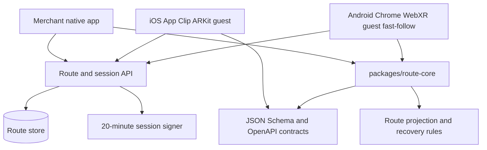
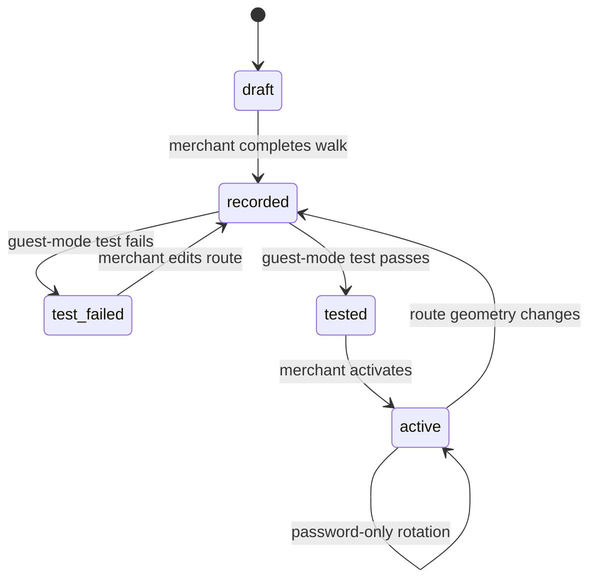
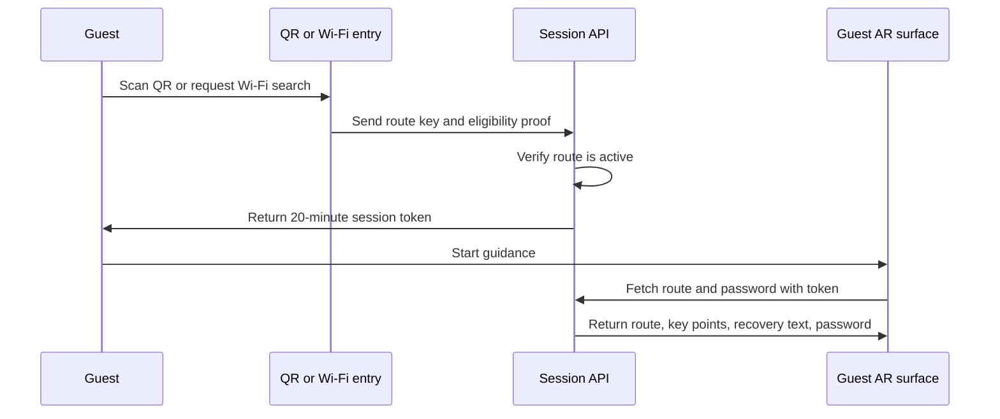

# Toilet AR Navigation MVP - Plan

## Goal Capsule

- **Objective:** Build a mobile-first AR restroom navigation MVP for cafes and restaurants whose restroom paths are outside the immediate storefront or hard to explain verbally.
- **Product authority:** This plan owns the first customer and guest experience: merchant-recorded restroom routes, QR or in-store Wi-Fi entry, AR navigation, restroom password display, and activation quality gates.
- **Implementation authority:** The Product Contract below defines what the MVP must do. The Planning Contract defines how this greenfield repository should implement it.
- **Execution profile:** Greenfield codebase. Prove a thin vertical route first: one merchant recorder path, QR session creation, one guest AR runtime, one real route, and one device smoke. Add platform parity and Wi-Fi production eligibility after that loop works.
- **Stop conditions:** Stop if iOS App Clip ARKit use is rejected by a real build, if Android Chrome WebXR cannot start an immersive AR session on a supported device, or if Wi-Fi eligibility cannot be implemented without misleading permission prompts.

---

## Product Contract

### Summary

Build a restroom navigation app where a cafe or restaurant owner records the path from a store QR location to the restroom by walking it once, marks key points along the way, tests the result in guest mode, and then exposes the route to guests through QR or in-store Wi-Fi search.
Guests get a 20-minute authenticated session that shows real-time AR floor guidance, key-point arrows, short instructions, and the restroom password from the start of the route.

Product Contract preservation: Product Contract unchanged; planning resolved platform and route-data decisions without changing R1-R17, F1-F4, or AE1-AE4.

### Problem Frame

Many small cafes and restaurants use restrooms that are outside the immediate store area, around a corner, upstairs, down a corridor, or behind a shared building door.
Staff often have to explain the same route repeatedly, and guests who are in a hurry can miss a turn, return to ask again, or fail to find the restroom quickly.
Public restroom-search products are not the right identity for this MVP because many merchants want to help their current guests without advertising restroom access to everyone nearby.

### Actors

- A1. **Merchant:** A cafe or restaurant owner or staff member who registers the store, records the restroom path, marks key points, enters restroom password information, tests the route, and activates guest access.
- A2. **Guest:** A current store visitor who enters through QR or in-store Wi-Fi search and follows AR guidance to the restroom.
- A3. **Service:** The backend and app experience that validates access, stores route/password metadata, issues a short guest session, and serves navigation data.

### Key Decisions

- **Primary target is cafes and restaurants.** This includes stores inside larger commercial buildings, but the active customer is the individual store rather than the whole building. Governs R1, R2.
- **Overall experience is full AR navigation.** Photo/text is not the main product; supporting instructions exist to recover from tracking uncertainty and confirm landmarks. Governs R14, R15, R16, R17.
- **Entry is private by default.** Guests enter by QR or in-store Wi-Fi search; whole-market public search is outside the MVP identity. Governs R4, R10, R11.
- **Wi-Fi is an entry qualification, not a continuous requirement.** Once the guest session opens, navigation continues even if the guest leaves the Wi-Fi range. Governs R12.
- **Restroom password is available early.** Authenticated guests can view the password near the start of guidance so they can memorize it before reaching the door. Governs R8, R13.
- **Merchant testing gates activation.** Merchant-recorded routes do not become guest-visible until the merchant completes a guest-mode test. Governs R9.

### Requirements

**Merchant Setup**

- R1. The product must let a cafe or restaurant merchant register a store and create at least one restroom route for that store.
- R2. The product must support stores whose restroom path leaves the storefront, enters a shared building area, changes floors, or passes through a shared corridor.
- R3. The merchant must be able to generate or associate a QR entry point for the store route.
- R4. The merchant must be able to enable in-store Wi-Fi search as a private backup entry path without making the store available in public search.

**Route Recording**

- R5. The merchant must record the restroom path by starting at the QR location and physically walking to the restroom while the app tracks the route.
- R6. During recording, the merchant must be able to mark key points such as corners, stairs, elevators, doors, and the password-entry location.
- R7. Complex routes may support additional intermediate QR checkpoints later, but the MVP starts from one store QR entry point.
- R8. The merchant must be able to enter and edit the restroom password displayed to guests; the app does not control or change the physical password device.
- R9. Route activation must require a guest-mode test pass before QR or Wi-Fi entry can expose the route to guests.

**Guest Entry and Session**

- R10. Guests must enter through a store QR code or through in-store Wi-Fi search for registered stores that enabled it.
- R11. Public search that exposes stores to anyone nearby must not be part of the MVP.
- R12. After valid QR or Wi-Fi entry, the guest must receive a 20-minute session that can continue after Wi-Fi disconnects.
- R13. The guest must be able to view the restroom password near the start of the session through a clear password-view action.

**AR Guidance**

- R14. The primary guest guidance must be real-time AR navigation over the live camera view.
- R15. The AR view must show a floor path during normal travel and larger arrows with short text at key points.
- R16. The guidance must help with direction at confusing areas and final confirmation at the restroom rather than promising centimeter-level positioning.
- R17. If AR tracking becomes unreliable, the experience must provide recovery guidance or supporting landmark information without ending the session.

### Key Flows

- F1. Merchant records and activates a route
  - **Trigger:** A merchant wants to make restroom guidance available for a store.
  - **Actors:** A1, A3.
  - **Steps:** The merchant registers the store, sets the QR entry location, starts route recording, walks to the restroom, marks key points, enters the password, runs guest-mode testing, and activates the route after the test passes.
  - **Outcome:** The route becomes available through QR and any enabled in-store Wi-Fi search entry.
  - **Covers:** R1, R3, R5, R6, R8, R9.

- F2. Guest enters through QR
  - **Trigger:** A guest scans the store QR code.
  - **Actors:** A2, A3.
  - **Steps:** The service validates the route, opens a 20-minute guest session, shows the password-view action, and starts AR guidance from the QR location.
  - **Outcome:** The guest follows live AR navigation to the restroom even if network conditions change during the walk.
  - **Covers:** R10, R12, R13, R14, R15.

- F3. Guest enters through in-store Wi-Fi search
  - **Trigger:** A guest is on the store Wi-Fi and searches for the store in the app or web entry surface.
  - **Actors:** A2, A3.
  - **Steps:** The service confirms the in-store Wi-Fi eligibility, limits results to matching registered stores, opens a 20-minute guest session, and starts the same AR guidance used by QR entry.
  - **Outcome:** The guest can start guidance without scanning QR, while the store remains hidden from public search.
  - **Covers:** R4, R10, R11, R12.

- F4. Guest recovers from tracking uncertainty
  - **Trigger:** The AR session loses reliable tracking because of lighting, low visual detail, fast phone movement, or temporary camera interruption.
  - **Actors:** A2, A3.
  - **Steps:** The app prompts the guest to slowly scan the surroundings, uses marked key points and landmark text to re-orient the guest, and keeps the session active.
  - **Outcome:** The guest can continue guidance without restarting or returning to the store.
  - **Covers:** R6, R17.

### Acceptance Examples

- AE1. QR entry starts a private guidance session
  - **Covers:** R10, R12, R13, R14.
  - **Given:** A merchant has activated a tested route.
  - **When:** A guest scans the store QR code.
  - **Then:** The guest receives a 20-minute session, can view the password, and sees AR guidance from the QR location.

- AE2. Wi-Fi entry survives leaving the store signal
  - **Covers:** R4, R12.
  - **Given:** A guest opened guidance through in-store Wi-Fi search.
  - **When:** The guest walks outside Wi-Fi range while following the route.
  - **Then:** The current session remains available until its 20-minute expiry.

- AE3. Public search does not expose the store
  - **Covers:** R11.
  - **Given:** A registered store has not enabled any public listing.
  - **When:** A nearby non-guest searches without QR or eligible Wi-Fi context.
  - **Then:** The store route and password are not shown.

- AE4. Untested merchant route is blocked
  - **Covers:** R9.
  - **Given:** A merchant recorded a route but has not passed guest-mode testing.
  - **When:** The merchant tries to activate QR or Wi-Fi entry.
  - **Then:** The product keeps the route unavailable to guests and asks the merchant to complete testing.

### Success Criteria

- Guests can start guidance quickly from QR without account creation or unnecessary setup.
- A merchant can record, test, and activate a simple restroom path without operator assistance.
- A valid guest can see the restroom password early enough to memorize it before reaching the door.
- The product does not behave like a public restroom discovery app in the MVP.
- AR tracking uncertainty does not strand the guest without fallback context.

### Scope Boundaries

**Deferred for later**

- Paid pricing, subscription packaging, and merchant billing.
- Public restroom discovery or nearby restroom search.
- Multiple intermediate QR checkpoints for complex buildings.
- Operator-assisted route setup or admin approval workflow.
- Direct integration with electronic door locks or password devices.

**Outside this product's MVP identity**

- A general map of all available restrooms near the user.
- A public listing that encourages non-customers to visit a store only for restroom access.
- A product that depends on continuous Wi-Fi connectivity during the whole restroom trip.

**Deferred to Follow-Up Work**

- Android native installed guest app parity after the WebXR route proves demand.
- Additional intermediate QR checkpoints for multi-floor or low-texture buildings.
- Merchant analytics, staff training views, and multi-store account hierarchy.
- Durable visual localization maps beyond the route/key-point model.

---

## Planning Contract

### Key Technical Decisions

- KTD1. **Use a hybrid no-install guest strategy, but prove one route first.** iOS guest entry uses an App Clip backed by ARKit, while Android guest entry uses Chrome WebXR backed by ARCore. The implementation sequence proves one guest runtime before requiring both. Google Play Instant is excluded because Google says Instant Apps will no longer be available starting December 2025. Governs R10, R14, R15.
- KTD2. **Keep merchant recording in one installed native pilot first.** Merchant recording needs reliable camera, motion, persistence, and test tooling. Implement one installed native pilot recorder first, then add the second merchant-native platform after route recording and replay are proven. Governs R1, R5, R6, R8, R9.
- KTD3. **Model routes as key-point paths with a calibration contract.** Store a start QR anchor, expected phone orientation, initial heading confirmation, segment distance/heading, ordered key points, floor transitions, landmark text, drift threshold, and recovery metadata. The AR renderer advances by segment progress, manual next-point recovery, and pose-confidence thresholds rather than by centimeter-level indoor positioning. Governs R2, R5, R6, R15, R16, R17.
- KTD4. **Sequence Wi-Fi as backup eligibility after QR value is proven.** The first vertical pilot implements QR entry and a Wi-Fi placeholder that always degrades to QR instructions. Production Wi-Fi eligibility must later use a nonce-bound, short-lived, server-recognized proof with replay protection, production rejection of mock proofs, and redacted SSID/BSSID handling. Governs R4, R10, R11, R12.
- KTD5. **Issue route-bound signed 20-minute guest sessions from the backend.** QR and later Wi-Fi entry exchange route eligibility for a short-lived session token with route, audience, issued-at, and expiry claims. Tokens must stay out of localStorage, be redacted from logs, and reject expired or tampered values. Governs R10, R12, R13.
- KTD6. **Gate activation through a recorded guest-mode test run.** A route can be `draft`, `recorded`, `test_failed`, `tested`, or `active`. Route-geometry edits reset an active route to `recorded`; password-only edits rotate the password and QR/session material without requiring route retest. Only `active` routes are visible to QR or Wi-Fi entry. Governs R9, AE4.
- KTD7. **Use a TypeScript monorepo with schema contracts for native shells.** Shared domain logic, API contracts, and WebXR rendering live in TypeScript packages. Native Swift/Kotlin shells consume JSON Schema or OpenAPI-generated route/session models plus thin native adapters; they do not directly import TypeScript runtime code.
- KTD8. **Treat route password, QR keys, and Wi-Fi proofs as sensitive data.** Merchant endpoints require authentication and store ownership checks. Restroom passwords are sensitive fields with protected storage, redacted serialization/logging, and rotation behavior. QR keys are high-entropy, route/version-bound, revocable, and rate-limited.

### High-Level Technical Design







### Output Structure

```text
apps/
  api/
  guest-webxr/
  ios/
  android/
  merchant-admin/
packages/
  route-core/
  ui/
  config/
docs/
  ar-device-test-matrix.md
  merchant-route-recording-runbook.md
```

### Assumptions

- The first implementation creates a greenfield monorepo because the current repository contains only `README.md`, `AGENTS.md`, and this plan.
- The first prototype supports one store, one route per store, and route lengths up to about 90 seconds of walking with up to 12 key points.
- QR entry is the primary guest entry path. Production Wi-Fi eligibility is a fast-follow after QR and AR usability are proven.
- Android no-install native entry is not planned because Google Play Instant is being discontinued. Android no-install AR uses WebXR on compatible Chrome and ARCore devices.
- iOS web AR is not the MVP path. iOS no-install AR uses App Clip plus ARKit.

### Risks and Dependencies

| Risk | Impact | Mitigation |
|---|---|---|
| App Clip size and framework limits | iOS guest AR may not fit the intended App Clip package | Run a QR-invoked ARKit App Clip spike before broad implementation |
| Android WebXR device/browser support | Some guests cannot start AR from Chrome | Detect support before session creation and show fallback route instructions |
| Wi-Fi permission friction | Guests may reject Wi-Fi permissions during urgent use | Defer production Wi-Fi eligibility until after QR value is proven |
| Low visual texture or poor lighting | AR path can drift or lose tracking | Use key-point arrows, landmark text, and recovery prompts as first-class route data |
| Route/password sensitivity | Non-guests could access private restroom details | Require merchant authz, active route state, signed short-lived sessions, redacted logs, and QR rate limits |

---

## Implementation Units

### U1. Scaffold the greenfield monorepo and platform spikes

- **Goal:** Create the repository structure and prove the QR-invoked iOS App Clip ARKit path before broad implementation.
- **Requirements:** Supports MVP surfaces for R1-R6 and R8-R17; preserves R7 as deferred scope.
- **Dependencies:** None.
- **Files:** `package.json`, `pnpm-workspace.yaml`, `tsconfig.base.json`, `apps/api/`, `apps/guest-webxr/`, `apps/ios/`, `apps/android/`, `apps/merchant-admin/`, `packages/route-core/`, `packages/ui/`, `packages/config/`, `docs/ar-device-test-matrix.md`.
- **Approach:** Set up a TypeScript workspace for shared code and web/API apps. Add native app directories with minimal build documentation and placeholders so ARKit/ARCore work has a clear home. Define root scripts for typecheck, lint, test, and format. Add an early App Clip spike that verifies QR invocation, ARKit session startup, package size budget, minimum iOS target, and fallback path if App Clip AR is not viable.
- **Execution note:** This is scaffolding; prefer install and smoke verification over behavior tests.
- **Patterns to follow:** Existing repo convention is minimal markdown-first documentation. Keep generated project files focused and avoid unrelated sample screens.
- **Test scenarios:** Test expectation: none -- this unit establishes project scaffolding and root commands.
- **Verification:** Root workspace commands exist, package installation works, empty app/package projects can be discovered by the workspace, and the App Clip spike result is recorded.

### U2. Implement route and session domain core

- **Goal:** Define the shared route, key-point, activation, password, and guest-session domain model.
- **Requirements:** R1, R2, R5, R6, R8, R9, R12, R13, R16, R17; F1-F4; AE1-AE4.
- **Dependencies:** U1.
- **Files:** `packages/route-core/src/route.ts`, `packages/route-core/src/session.ts`, `packages/route-core/src/activation.ts`, `packages/route-core/src/wifiEligibility.ts`, `packages/route-core/src/recovery.ts`, `packages/route-core/src/progress.ts`, `packages/route-core/src/index.ts`, `packages/route-core/schema/`, `packages/route-core/test/route.test.ts`, `packages/route-core/test/session.test.ts`, `packages/route-core/test/activation.test.ts`, `packages/route-core/test/wifiEligibility.test.ts`, `packages/route-core/test/progress.test.ts`.
- **Approach:** Model stores, routes, route segments, key points, floors, password metadata, activation state, session expiry, calibration, and route progress as pure domain types and validators. Keep platform AR poses outside the durable model. Export JSON Schema/OpenAPI-compatible contracts so Swift and Kotlin surfaces can generate or mirror route/session models.
- **Execution note:** Implement domain behavior test-first because this package becomes the contract for every app surface.
- **Patterns to follow:** Use plain TypeScript modules and deterministic tests. Keep platform-specific permissions and AR APIs out of `packages/route-core`.
- **Test scenarios:**
  - Covers AE1. Given an active route, when a QR entry creates a session, then the session expires 20 minutes after issue time and includes password-view permission.
  - Covers AE2. Given a Wi-Fi-created session, when Wi-Fi eligibility is no longer present after session creation, then the session remains valid until expiry.
  - Covers AE3. Given no QR token and no eligible Wi-Fi proof, when route discovery is requested, then route and password metadata are not returned.
  - Covers AE4. Given a route in `recorded` or `test_failed`, when activation is requested, then activation is rejected until a guest-mode test pass exists.
  - Given a route with stairs, doors, and a password-entry key point, when the route is serialized, then ordered key points and floor transitions are preserved.
  - Given unreliable tracking state, when recovery guidance is requested, then the next key-point landmark and scan instruction are returned.
  - Given pose confidence drops below the drift threshold, when progress is evaluated, then the route falls back to manual next-point recovery.
- **Verification:** Route/session validators cover activation, expiry, password access, Wi-Fi eligibility placeholders, progress, calibration, and recovery decisions without platform dependencies.

### U3. Build the route and session API

- **Goal:** Provide backend endpoints for merchant store setup, route draft persistence, route activation, QR entry, Wi-Fi entry, and guest session route fetches.
- **Requirements:** R1, R3, R4, R8, R9, R10, R11, R12, R13; F1-F3; AE1-AE4.
- **Dependencies:** U1, U2.
- **Files:** `apps/api/src/server.ts`, `apps/api/src/routes/merchantRoutes.ts`, `apps/api/src/routes/guestEntry.ts`, `apps/api/src/routes/sessions.ts`, `apps/api/src/storage/schema.ts`, `apps/api/src/storage/store.ts`, `apps/api/src/security/sessionTokens.ts`, `apps/api/src/security/merchantAuth.ts`, `apps/api/test/merchantRoutes.test.ts`, `apps/api/test/guestEntry.test.ts`, `apps/api/test/sessions.test.ts`, `apps/api/test/security.test.ts`.
- **Approach:** Implement a small JSON API over the route-core package. Use the smallest in-repo storage module needed for local running and API tests. Defer a formal replaceable repository interface until a real database is introduced. QR entry uses a high-entropy opaque key bound to route version and rate limits. Wi-Fi entry initially exposes only a non-production placeholder that returns QR instructions unless a later production proof mechanism is enabled. Merchant endpoints require authentication and store ownership checks.
- **Execution note:** Start with failing API contract tests for QR entry, Wi-Fi entry, and activation gating.
- **Patterns to follow:** Keep request/response schemas close to route-core validators. Avoid embedding password values in public route discovery responses.
- **Test scenarios:**
  - Covers AE1. Given an active route and valid QR key, when `POST /guest/qr-session` is called, then it returns a 20-minute token and route fetch URL.
  - Covers AE2. Given a development-mode or later production Wi-Fi session token, when the route is fetched after the Wi-Fi proof is absent, then the token still works before expiry.
  - Covers AE3. Given a nearby search request without QR or eligible Wi-Fi proof, when the API handles it, then it returns no store route or password.
  - Covers AE4. Given an untested route, when activation is requested, then the API returns a blocked activation response.
  - Given a guest token is expired, when route or password metadata is fetched, then the API rejects the request.
  - Given a merchant updates a password, when a new guest session is issued, then it exposes the latest password value only to authenticated guest sessions.
  - Given an unauthenticated merchant request or a merchant for another store, when route, password, or activation mutation is requested, then the API rejects it.
  - Given a copied QR key is abused repeatedly, when session creation exceeds the rate limit or the route version changes, then session minting is rejected.
- **Verification:** API tests prove route activation, private entry, session expiry, merchant authorization, QR key rotation/rate limiting, redacted logs, and password access rules.

### U4. Build merchant setup and recording flows

- **Goal:** Let a merchant register a store, set a QR entry point, record a route through one native pilot recorder, mark key points, enter password information, and save a route draft.
- **Requirements:** R1, R2, R3, R5, R6, R8; F1.
- **Dependencies:** U1, U2, U3.
- **Files:** `apps/merchant-admin/src/`, `apps/ios/merchant/`, `packages/ui/src/merchant/`, `apps/merchant-admin/test/merchantSetup.test.ts`, `apps/merchant-admin/test/routeDraft.test.ts`, `docs/merchant-route-recording-runbook.md`.
- **Approach:** Build the first merchant setup flow in a web/admin surface for store and password data, and provide one iOS native pilot recorder for ARKit pose capture. The route recorder stores ordered segments and key points through the API rather than trying to persist a full visual map. Android merchant recording is a fast-follow after one recorder/replay loop works.
- **Execution note:** Characterize the data contract with tests before connecting native pose capture.
- **Patterns to follow:** Route data must flow through `packages/route-core`; native shells should adapt pose samples into shared route/key-point records.
- **Test scenarios:**
  - Given a new merchant store, when setup is completed, then a store and initial route draft are persisted.
  - Given a merchant marks corners, stairs, elevator, door, and password-entry points, when the draft is saved, then the ordered key-point list keeps type and instruction text.
  - Given a route leaves the storefront and changes floors, when it is saved, then the route includes floor transition metadata.
  - Given a merchant edits the restroom password, when the draft is saved, then the route uses the new password for future sessions.
  - Given native pose capture is unavailable in development, when a mock recording is submitted, then the same route-core validators are used.
  - Given camera or motion permission is denied during recording, when the merchant tries to start, then the UI explains the requirement and returns to setup without creating a partial route.
  - Given tracking weakens during recording, when the merchant pauses or marks a wrong key point, then they can pause, resume, edit, reorder, or delete key points before saving.
  - Given draft save fails, when the merchant retries, then the UI preserves the unsaved route draft and key-point edits.
- **Verification:** Merchant setup can create a route draft with QR metadata, password metadata, route segments, key points, and recoverable recording states.

### U5. Build activation rules and test-run records

- **Goal:** Enforce activation state, route versioning, and test-run records before the real guest-mode AR test flow exists.
- **Requirements:** R9; F1; AE4.
- **Dependencies:** U2, U3, U4.
- **Files:** `apps/merchant-admin/src/activation/`, `apps/api/src/routes/activation.ts`, `apps/api/test/activationFlow.test.ts`, `apps/merchant-admin/test/activationFlow.test.ts`.
- **Approach:** Implement a test-run record with route version, started/completed timestamps, observed key points, tracking warnings, and merchant pass/fail result. Activation requires a passing test run for the current route version. This unit creates the enforcement contract; U8 wires it to the real AR guest-mode test.
- **Execution note:** Start with failing tests for version mismatch and untested activation.
- **Patterns to follow:** Use the activation state machine from `packages/route-core`; do not duplicate activation rules in UI code.
- **Test scenarios:**
  - Covers AE4. Given no passing test run, when activation is requested, then activation is blocked.
  - Given a passing test run for an older route version, when the route is edited, then activation is blocked until a new pass exists.
  - Given only the password changes, when the merchant saves it, then the route remains active and session/QR material rotates without route retest.
  - Given tracking warnings during test mode, when the merchant marks the test as failed, then the route moves to `test_failed`.
  - Given a passing test run for the current route version, when activation is requested, then the route moves to `active`.
- **Verification:** Activation state changes are versioned, test-gated, password-aware, and enforced by the API and merchant UI.

### U6. Build QR and Wi-Fi guest entry surfaces

- **Goal:** Let guests start a private session through QR without account creation and provide a safe Wi-Fi fallback placeholder.
- **Requirements:** R4, R10, R11, R12, R13; F2, F3; AE1-AE3.
- **Dependencies:** U2, U3, U5.
- **Files:** `apps/guest-webxr/src/entry/`, `apps/ios/AppClip/Entry/`, `packages/ui/src/guest/PasswordPanel.tsx`, `apps/guest-webxr/test/entry.test.ts`, `apps/api/test/wifiEntry.test.ts`, `docs/ar-device-test-matrix.md`.
- **Approach:** Implement QR entry as the primary path. Implement Wi-Fi search as a placeholder that shows QR instructions unless a production proof mechanism is explicitly enabled later. The password action appears near the start of the session and requires the signed guest token. The guest entry state map must include QR loading, active route found, unavailable route, opened without QR, Wi-Fi unavailable, Wi-Fi denied, no eligible store, AR supported, and AR unsupported.
- **Execution note:** Add integration tests for private-entry denial before wiring platform permission prompts.
- **Patterns to follow:** Keep QR/session logic in shared entry services. Platform-specific Wi-Fi checks should adapt into route-core `WifiEligibilityProof`, but production proof stays disabled until its nonce, issuer, retention, and replay rules are implemented.
- **Test scenarios:**
  - Covers AE1. Given a valid QR key for an active route, when the guest enters, then the password action and AR start action are available without account creation.
  - Covers AE2. Given a development-mode or later production Wi-Fi proof, when the session starts and Wi-Fi later disconnects, then the route remains available until token expiry.
  - Covers AE3. Given no QR key and no eligible Wi-Fi proof, when search is attempted, then no store route or password appears.
  - Given Wi-Fi permission is denied, when the guest tries Wi-Fi entry, then the UI points to QR entry instead of showing public results.
  - Given the route is not active, when a QR code is scanned, then the guest sees an unavailable route state.
  - Given camera permission is denied or QR is not physically visible, when the guest tries entry, then the UI shows QR recovery instructions and no public search results.
  - Given the password panel is opened, when the session is valid, expired, loading, or failed, then collapsed, revealed, hidden, expired, loading, and error states behave without storing the password in browser localStorage.
- **Verification:** Guest entry tests prove QR-first flow, Wi-Fi placeholder fallback, no public discovery, password panel states, token storage rules, and token expiry.

### U7. Build AR guidance and recovery

- **Goal:** Render the route over the live camera with floor path guidance, key-point arrows, password access, and tracking recovery.
- **Requirements:** R13, R14, R15, R16, R17; F2, F4; AE1.
- **Dependencies:** U1, U2, U3, U6.
- **Files:** `apps/guest-webxr/src/ar/`, `apps/ios/AppClip/AR/`, `packages/route-core/src/projection.ts`, `packages/route-core/test/projection.test.ts`, `apps/guest-webxr/test/arGuidance.test.ts`, `apps/ios/AppClipTests/`.
- **Approach:** Implement shared projection rules for next segment, key-point prompt, and recovery prompt. The first runtime is the iOS App Clip ARKit path if U1 proves it viable; Android WebXR is the fast-follow no-install runtime. Fallback mode is an ordered landmark step list with current and next key point, floor transition label, password access, retry AR action, completion action, and non-color-only direction cues. Both surfaces show route progress by QR-origin calibration, segment distance/heading, manual next-point recovery, and pose-confidence thresholds rather than centimeter-level localization.
- **Execution note:** Use device smoke tests for AR session startup and automated tests for route projection/recovery rules.
- **Patterns to follow:** Keep platform rendering thin. Shared projection logic lives in `packages/route-core`.
- **Test scenarios:**
  - Covers AE1. Given an active QR session, when AR guidance starts, then the first floor path segment appears and the password action remains reachable.
  - Given a key point is next, when the guest approaches it in the route model, then a larger arrow and short instruction are shown.
  - Given tracking state becomes limited or unavailable, when the renderer reports degraded tracking, then recovery guidance asks the guest to scan slowly and shows the next landmark.
  - Given WebXR is unavailable on the Android browser, when the guest starts AR, then the UI shows supporting landmark instructions rather than a broken AR canvas.
  - Given ARKit device support is unavailable, when the App Clip starts, then it blocks AR startup with a fallback route state.
  - Given text scaling, screen reader, reduced motion, or high contrast settings are active, when guidance renders, then touch targets, labels, contrast over camera, and non-AR fallback remain usable.
- **Verification:** Shared projection tests pass, App Clip ARKit startup is smoke-tested, WebXR feature detection is covered for fast-follow, and device checks are recorded in `docs/ar-device-test-matrix.md`.

### U8. Wire real guest-mode route testing

- **Goal:** Connect the activation test-run contract to the guest AR runtime so merchants can pass or fail the current route version before activation.
- **Requirements:** R9, R14, R15, R16, R17; F1, F4; AE4.
- **Dependencies:** U5, U7.
- **Files:** `apps/merchant-admin/src/activation/GuestModeTest.tsx`, `apps/ios/merchant/GuestModeTest/`, `apps/api/src/routes/activation.ts`, `apps/api/test/activationFlow.test.ts`, `apps/merchant-admin/test/guestModeTest.test.ts`, `docs/merchant-route-recording-runbook.md`.
- **Approach:** Launch a merchant-controlled guest-mode test against the current route version. Record observed key points, recovery prompts shown, tracking warnings, completion, fail reason, and pass/fail result. A failed test shows the reason and a retest call to action.
- **Execution note:** Test version mismatch, fail reason persistence, and retest CTA before connecting native AR test capture.
- **Patterns to follow:** Reuse U5 activation state and U7 guidance/fallback states. Do not duplicate pass/fail rules in native code.
- **Test scenarios:**
  - Covers AE4. Given a merchant completes a passing guest-mode test for the current version, when activation is requested, then the route becomes active.
  - Given a merchant fails a test because of tracking or wrong key points, when they return to activation, then the failure reason and retest action are shown.
  - Given the route changes after a passing test, when activation is requested, then the stale pass is rejected.
  - Given password-only rotation happens after a passing test, when activation is checked, then the route remains active without retesting geometry.
- **Verification:** Guest-mode test execution produces versioned pass/fail records that the API enforces before guest exposure.

### U9. Add operational documentation and project wiki hooks

- **Goal:** Document local development, AR device testing, route recording, and Project Wiki Mode outputs.
- **Requirements:** Supports MVP surfaces for R1-R6 and R8-R17; preserves R7 as deferred scope.
- **Dependencies:** U1-U8.
- **Files:** `README.md`, `AGENTS.md`, `docs/ar-device-test-matrix.md`, `docs/merchant-route-recording-runbook.md`.
- **Approach:** Update repo documentation with setup commands, expected device matrix, manual AR smoke checks, and wiki-mode behavior. Do not write actual Obsidian Vault files unless `OBSIDIAN_VAULT_DIR` is set and the user asks for wiki mode.
- **Execution note:** This is documentation and operations work; verify by command smoke checks and doc link review.
- **Patterns to follow:** Preserve the existing Project Wiki Mode block in `AGENTS.md`.
- **Test scenarios:** Test expectation: none -- this unit updates developer and operations documentation.
- **Verification:** README setup instructions match the created workspace scripts and device test docs include iOS App Clip, Android Chrome WebXR, and permission-denied paths.

---

## Verification Contract

| Gate | Applies to | Done signal |
|---|---|---|
| Workspace install | U1-U9 | The package manager installs dependencies and discovers all workspace packages |
| Typecheck | U1-U9 | Shared packages, API, and web apps typecheck without errors |
| Unit tests | U2, U3, U5, U7, U8 | Route-core, API, activation, session, projection, and Wi-Fi eligibility tests pass |
| Integration tests | U3, U6 | QR entry, Wi-Fi entry, private search denial, session expiry, and password access pass |
| Native build smoke | U1, U4, U7, U8 | iOS App Clip and pilot merchant recorder shells build far enough to verify AR capability checks |
| Device smoke | U1, U7 | `docs/ar-device-test-matrix.md` records one QR-invoked iOS ARKit/App Clip path; Android Chrome WebXR is documented as fast-follow if not implemented |
| Privacy/security review | U3, U6 | Merchant authz, public search denial, QR rate limits, token redaction, password protection, and expired/tampered-token rejection are covered |
| Accessibility review | U6, U7 | Touch targets, screen reader labels, text scaling, reduced-motion/non-AR path, and camera-overlay contrast are checked |
| Documentation review | U9 | README and runbooks match the implemented commands and supported device paths |

---

## Definition of Done

- The repository contains a runnable greenfield workspace with API, guest, merchant, shared route-core, and documentation surfaces.
- The Product Contract remains traceable: every R-ID that affects implementation is cited by at least one U-ID, test scenario, verification gate, or scope boundary.
- QR entry creates a 20-minute private guest session for an active route and does not require a guest account.
- Wi-Fi entry is optional, permission-aware, private, and does not become public restroom search; production Wi-Fi proof may remain a fast-follow if QR fallback is implemented.
- Merchant activation is blocked until the current route version has a passing guest-mode test.
- Guest password access is available near the start of the session and requires a valid session token.
- AR guidance starts on the first supported QR-launched runtime, with iOS App Clip/ARKit as the preferred pilot. Android Chrome WebXR is either implemented as a fast-follow or documented with support detection and fallback behavior.
- Automated tests cover route/session domain rules, API activation/session rules, private entry denial, session expiry, password access, and projection/recovery logic.
- Manual device smoke results are recorded for the supported AR entry paths.
- Dead-end experimental code is removed before final handoff.

---

## Sources / Research

- Apple App Clips documentation describes App Clips as lightweight, in-the-moment app experiences available without installing the full app: https://developer.apple.com/documentation/appclip
- Apple App Clip functionality guidance documents size limits and App Clip constraints that must be verified early: https://developer.apple.com/documentation/AppClip/choosing-the-right-functionality-for-your-app-clip
- Apple ARKit world tracking documentation describes visual-inertial odometry and notes lighting, visual detail, and motion constraints that shape recovery guidance: https://developer.apple.com/documentation/arkit/understanding-world-tracking
- Google ARCore fundamentals describe SLAM, feature points, plane detection, depth, lighting, hit testing, anchors, and texture limitations: https://developers.google.com/ar/develop/fundamentals
- Google ARCore WebXR documentation states that WebXR AR uses ARCore to power AR in Google Chrome on Android: https://developers.google.com/ar/develop/webxr
- Google Play Instant documentation states that Google Play Instant will no longer be available starting December 2025: https://developer.android.com/topic/google-play-instant/overview
- Apple Wi-Fi information documentation and TN3111 indicate that current Wi-Fi information is permission- and entitlement-gated on iOS: https://developer.apple.com/documentation/SystemConfiguration/CNCopyCurrentNetworkInfo and https://developer.apple.com/documentation/technotes/tn3111-ios-wifi-api-overview
- Android Wi-Fi permission documentation indicates that Android 13+ apps using Wi-Fi APIs need `NEARBY_WIFI_DEVICES`, while older paths and some APIs still depend on location permissions: https://developer.android.com/develop/connectivity/wifi/wifi-permissions
- Android `WifiInfo` documentation says SSID/BSSID fields are redacted when callers lack sufficient permissions: https://developer.android.com/reference/android/net/wifi/WifiInfo
- Project Wiki Mode guidance from `mayreel0/effective-doodle` was applied to this repository through `AGENTS.md`: https://github.com/mayreel0/effective-doodle/blob/main/docs/operations/project-wiki-mode.md
